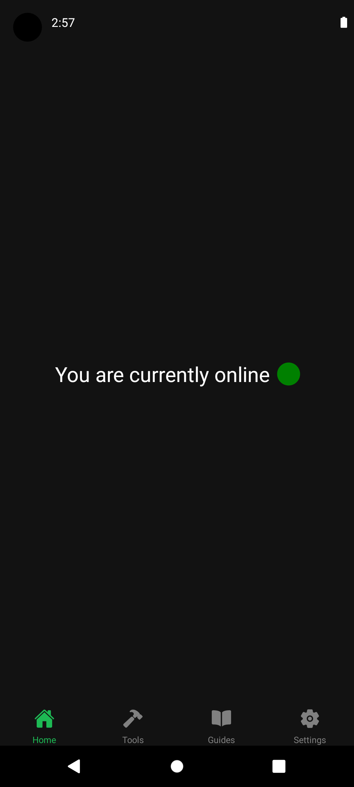
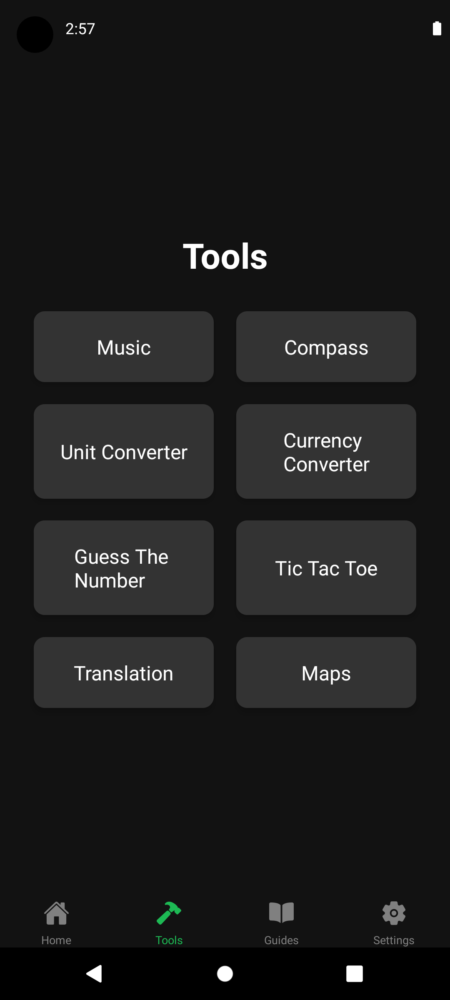
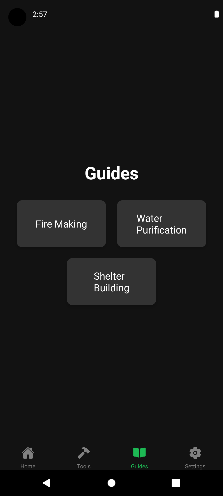
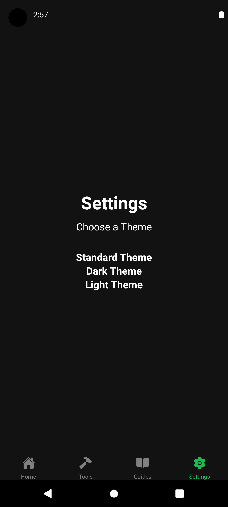
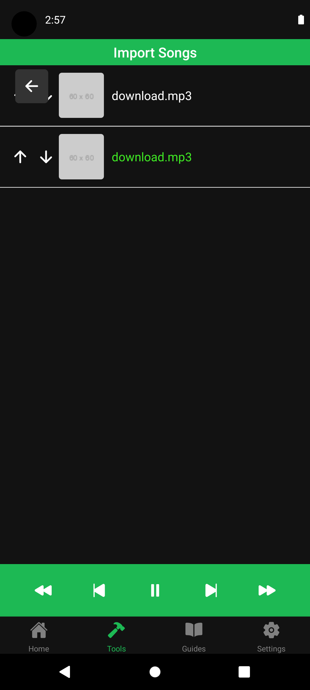
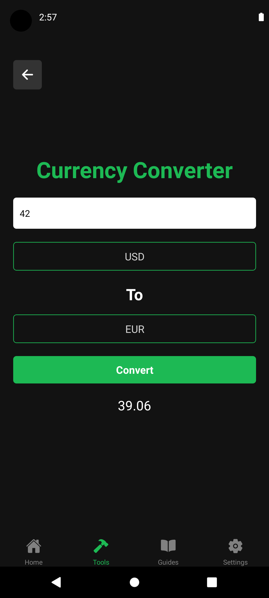
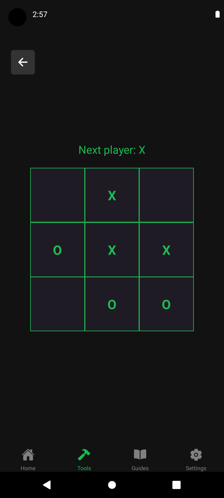
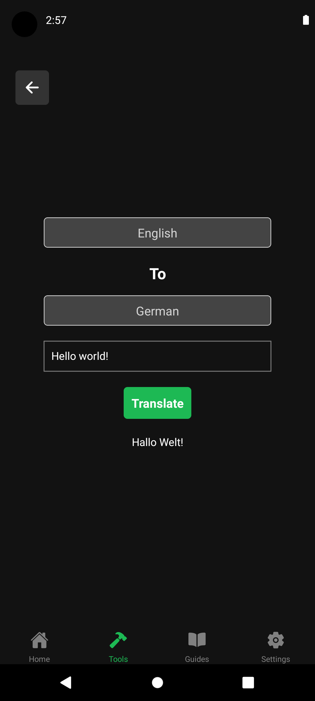
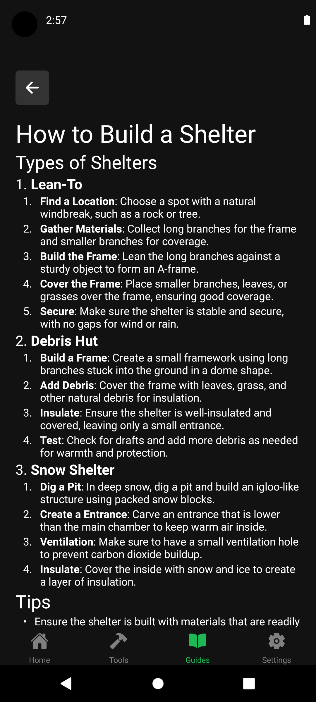

# GoOffline App
GoOffline is a user-friendly mobile application designed to keep you connected and productive, even when you're offline. Whether you need to convert units, track your internet connection status, or manage your tasks, GoOffline has got you covered. With its intuitive design, ensuring you have the tools you need at your fingertips.

## Screenshots
<style>
  .carousel {
    display: flex;
    justify-content: center; /* Centers the carousel */
    overflow: hidden;
    width: 100%;
    max-width: 600px; /* Set a max-width for your carousel */
    margin: 20px auto;
  }

  .carousel-inner {
    display: flex;
    transition: transform 0.5s ease-in-out;
    width: 100%;
  }

  .carousel-item {
    display: flex;
    justify-content: center; /* Centers images within each item */
    align-items: center; /* Centers images vertically */
    min-width: 100%;
    transition: opacity 0.5s ease;
  }

  input[type="radio"] {
    display: none;
  }

  /* Carousel navigation */
  .carousel-nav {
    text-align: center;
    margin-top: 10px;
  }

  .carousel-nav label {
    cursor: pointer;
    font-size: 1.5em;
    margin: 0 5px;
  }

  /* Image transition */
  #carousel-item-1:checked ~ .carousel-inner {
    transform: translateX(0%);
  }

  #carousel-item-2:checked ~ .carousel-inner {
    transform: translateX(-100%);
  }

  #carousel-item-3:checked ~ .carousel-inner {
    transform: translateX(-200%);
  }

  #carousel-item-4:checked ~ .carousel-inner {
    transform: translateX(-300%);
  }

  #carousel-item-5:checked ~ .carousel-inner {
    transform: translateX(-400%);
  }

  #carousel-item-6:checked ~ .carousel-inner {
    transform: translateX(-500%);
  }

  #carousel-item-7:checked ~ .carousel-inner {
    transform: translateX(-600%);
  }

  #carousel-item-8:checked ~ .carousel-inner {
    transform: translateX(-700%);
  }

  #carousel-item-9:checked ~ .carousel-inner {
    transform: translateX(-800%);
  }

  /* Optional: make carousel images responsive */
  .carousel-inner img {
    width: 50%;
    max-width: 90%; /* Limits the width of the image */
    height: auto;
    border-radius: 10px;
  }
</style>

<div class="carousel">
  <!-- Carousel Items -->
  <input type="radio" id="carousel-item-1" name="carousel" checked>
  <input type="radio" id="carousel-item-2" name="carousel">
  <input type="radio" id="carousel-item-3" name="carousel">
  <input type="radio" id="carousel-item-4" name="carousel">
  <input type="radio" id="carousel-item-5" name="carousel">
  <input type="radio" id="carousel-item-6" name="carousel">
  <input type="radio" id="carousel-item-7" name="carousel">
  <input type="radio" id="carousel-item-8" name="carousel">
  <input type="radio" id="carousel-item-9" name="carousel">
  <div class="carousel-inner">
    <div class="carousel-item">
      
    </div>
    <div class="carousel-item">
      
    </div>
    <div class="carousel-item">
      
    </div>
    <div class="carousel-item">
      
    </div>
    <div class="carousel-item">
      
    </div>
    <div class="carousel-item">
      
    </div>
    <div class="carousel-item">
      
    </div>
    <div class="carousel-item">
      
    </div>
    <div class="carousel-item">
      
    </div>
  </div>
</div>

<!-- Carousel Navigation -->
<div class="carousel-nav">
  <label for="carousel-item-1">●</label>
  <label for="carousel-item-2">●</label>
  <label for="carousel-item-3">●</label>
  <label for="carousel-item-4">●</label>
  <label for="carousel-item-5">●</label>
  <label for="carousel-item-6">●</label>
  <label for="carousel-item-7">●</label>
  <label for="carousel-item-8">●</label>
  <label for="carousel-item-9">●</label>
</div>

## Tools

- ### Music Player
- ### Compass
- ### Unit Converter
- ### Currency Converter
- ### Tic Tac Toe
- ### Guess The Number
- ### Translation
- ### Maps

### Tools and Libraries Used
- **React Native**: The core framework used to build the app.
- **react-native-vector-icons/Ionicons**: For using Ionicons as icons in the app.
- **@react-native-community/netinfo**: To detect and handle internet connectivity status.
- **react-native-modal-selector**: For implementing the modal selectors used in unit conversion.
- **Animated API**: For adding smooth animations to the connectivity status indicator.
- **react-native-document-picker**: For selecting and importing audio files from the device.
- **react-native-sound**: For playing and controlling audio files.
- **react-native-fs**: For handling file system operations, such as copying audio files to a specific directory.
- **@react-native-async-storage/async-storage**: For remembering all imported songs.
- **fast-mlkit-translate-text**: For downloading translation models and translating offline.
- **react-native-sensors**: For the compass.

## Installation
### Option 1: Download from Latest Release
1. **Download the Latest Release**: Go to the Releases page and download the latest version of the app.
2. **Install the App**: Follow the instructions provided in the release notes to install the downloaded app on your device.

### Option 2: Run from Source
### Prerequisites
- **Node.js**: Ensure you have Node.js installed on your machine.
- **React Native CLI**: Install the React Native CLI if you haven't already.
- **Android Studio/Xcode**: For running the app on an Android or iOS emulator.

### Steps
1. **Clone the Repository**:
   ```bash
   git clone https://github.com/PrintN/GoOffline.git
   cd GoOffline
2. **Install Dependencies**:
   ```bash
   npm install
3. **Start the Metro Bundler**:
   ```bash
   npx react-native start
4. **Run the App**:
   ```bash
   npx react-native run-android
   Or
   npx react-native run-ios
## Contributing
We welcome contributions to enhance the GoOffline app. If you have suggestions or want to report an issue, please create a pull request or open an issue on our GitHub repository.

## License
This project is licensed under the GPL-3.0 license. See the [LICENSE](LICENSE) file for details.
